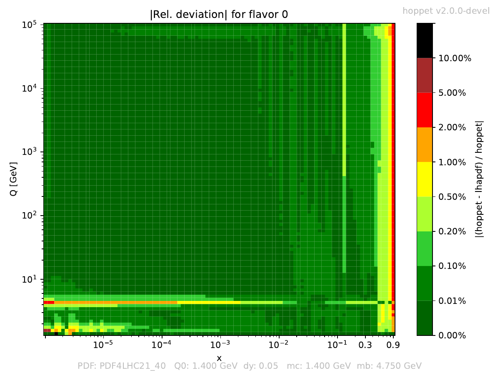
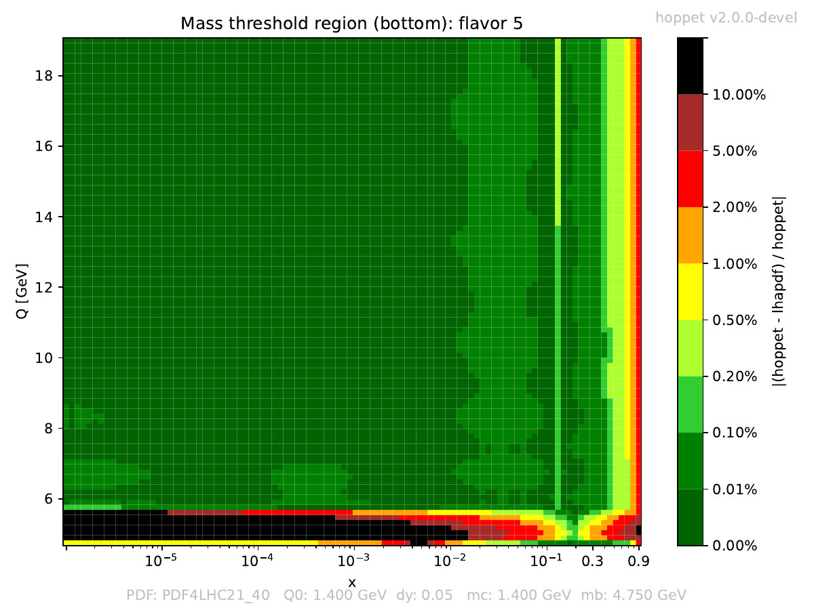

# hoppet-lhapdf-grid-checker
Small python script that reads an LHAPDF grid and compares its
internal evolution to that of hoppet. The script prints a number of
useful diagnostics to screen and produces a set of plots to compare
the two evolutions.

## Getting started
The code requires that both hoppet's and LHAPDF's python interfaces
have been built and are visible to python. Assuming that is the case,
and that all other dependencies are met (if the script complains about
a missing package try `pip install package`) the code can simply be
run with

```
./check-lhapdf-set-with-hoppet.py -pdf LHAPDFname
```

To get a full list of commandline arguments run
```
./check-lhapdf-set-with-hoppet.py --help
``` 
for a standard user the only flag that is needed is `-pdf` and if
plots are required `-do-plots`. As an example, running

```
./check-lhapdf-set-with-hoppet.py -pdf PDF4LHC21_40 -do-plots
```

will initialise hoppet at $Q_{\mathrm{min}}$ of PDF4LHC21_40, and fill
a grid using hoppet's evolution. This grid is then compared to the
LHAPDF grid across a large range of $x$ and $Q$ and relative
deviations are computed. If the scripts decides that there are regions
with large deviations (the threshold can be set with `-prec-threshold`
which by default is `5d-3`) they will be printed in <span
style="color:red">red</span> on screen. The results are printed on
screen and saved in `PDF4LHC21_40_Q01.4001_hoppet_check.txt`.

The plots can be found in `PDF4LHC21_40_Q01.4001_hoppet_check.pdf`.
The heatmaps should be green -- if not then there are regions with
deviations. Below you can see the gluon, across the full range of $Q$ and $x$, and the bottom close to its production threshold.
<table>
<tr>
<td></td>
<td></td>
</tr>
</table>

Both the `.txt` and `.pdf` files can be found in the [example](example/) directory.

## Contact and bugs
Please get in touch on
[alexander.karlberg@cern.ch](mailto:alexander.karlberg@cern.ch) for
any queries or bug reports (or directly on gitHub).